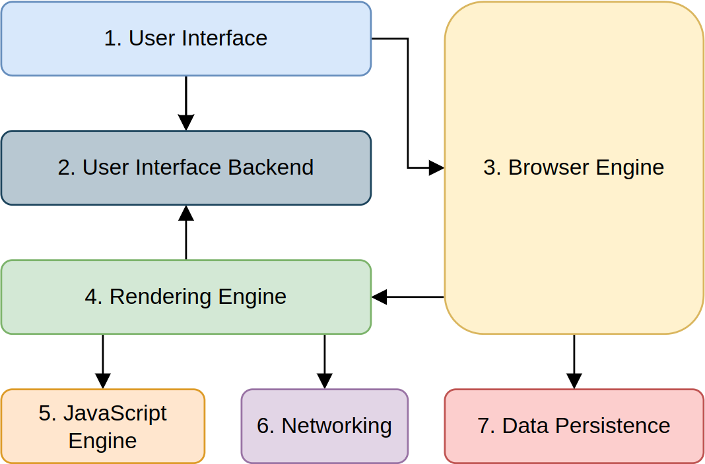

# Analysis and measurement of CSS animation performance for selected web browsers

My Master's thesis on analysis and measurement of CSS animation performance for selected web browsers. This topic allowed me to acquire deeper knowledge of CSS animations, both 2D and 3D, browser components and inner-working of browser engines. I was also able to understand which browsers are the most performant in terms of displaying CSS animations.

A summary of the thesis can be found below. For demo purposes I selected two animations out of ten presented in the full thesis: Animation 6 and 10.

Full thesis can be found in a file called `Masters-Thesis-Bilal-Hassona.pdf` placed in the root directory of this repository.

## 1. Animations

### 1.1. Animation 6

### 1.2. Animation 10

## 2. Results

### 2.1. Animation 6

Graph with results for animation 6:

Table with results for animation 6:

### 2.2. Animation 10

Graph with results for animation 6:

Table with results for animation 10:

## 3. Discussion

The first thing worth noting is that for some animations a peak fps is reached for the second threshold and in most cases it’s a significant growth of 10 – 20 fps between the first and the second measured threshold. This phenomenon occurs for all or almost all browsers in animations 2, 3 and 4, for browsers: Brave, Vivaldi and Yandex Browser in animation 1 and for browsers: Konqueror, Chromium and Vivaldi in animation 8. This might be a result of some in-browser optimizations for animating specific CSS properties.
The second unusual phenomenon is Mozilla Firefox scoring the highest or in the top in eight of the animations and surprisingly the worst in two animations reaching around 9 and around 17 fps consistently for all thresholds. This result might be explained by a lack of optimization for animating the scaling and the background or gradient background.
Also, it can be noticed, that in animations 7 and 8, that is animating the CSS property “width” by setting the value in pixels instead of percentage seems to be less performant for some browsers. This is contrary to what might be expected as one could assume that units do not influence the animation performance or that setting the value in pixels would be more performant.

## 4. Methodology

   

## 5. Theory

### 5.1. Browser components

   

1. The User Interface serves as the tangible bridge between the user and the browser's complex internal mechanisms. It consists of all UI elements that users interact with directly such as address bar for URL input, navigation buttons such as back and forward, bookmarks, reload page button and others.

2. The User Interface Backend is a system that converts generic graphical control elements into the specific visual components of an operating system's graphical user interface (GUI). This layer of abstraction enables developers to create and implement user interface elements like buttons, checkboxes, and menus without worrying about the unique aspects of different operating systems.

3. The Browser Engine acts as an intermediary between the user interface and the rendering engine, processing UI commands and instructing the rendering engine accordingly. It manages the browser's high-level architecture, coordinating interactions between the UI, rendering engine, and other components. When a user requests a web page, the browser engine interfaces with the network, retrieves the document, and prompts the rendering engine to display it.

4. The rendering engine, also called the layout engine, is crucial for converting web content into the visual output users see. It interprets HTML and CSS files to display formatted web pages on the screen. Closely integrated with the browser engine, they are often considered a single entity. Further details about the rendering engine are provided in Subsection 3.2, as it is a key focus of this thesis.

5. In web browsers, the JavaScript engine is essential for interpreting and executing JavaScript code within web pages, enabling interactive and dynamic content. The engine parses JavaScript code, converts it into bytecode, and then compiles it into machine code using just-in-time (JIT) compilation. This process occurs every time a web page loads, enabling interactive elements to function.

6. The networking component manages network calls, such as HTTP requests, to fetch resources like HTML, images, and scripts. It supports various protocols (HTTP, HTTPS, FTP) and handles internet communication, including server requests, cookies, and security features, enabling the browser to display web content.

7. The data persistence component handles the storage and retrieval of data across browsing sessions, enhancing the user's experience by enabling features like form auto-fill and saving preferences. It manages various storage types, including cookies, local storage, and IndexedDB, allowing websites to store data on the user's device that can be accessed even after the browser is closed and reopened.

### 5.2. Rendering engines

Webkit browser engine’s general flow:

   

Gecko browser engine’s general flow:

   

The rendering engine processes and displays the HTML and CSS files immediately, to the best of its ability, even if not all HTML/CSS files are yet delivered through the network. The rendering process is gradual and is partially or fully repeated multiple times if needed.

The rendering engine parses an HTML file and creates a tree called “content tree” filled with the DOM (Document Object Model) nodes. The same process happens for CSS files and style definitions in the HTML file. Gecko has one additional step called “content sink” which is a factory for creating DOM elements.

Next, these two trees are merged into a new tree called “render tree” or “frame tree”. The order of elements is preserved in the same order they will be rendered. The render tree includes “objects” or “frames” containing information about styles such as dimensions or background colour.

Then, the render tree undergoes a process called “layout” or “reflow” wherein each DOM node is assigned the exact coordinates on the screen.

Lastly, the render tree is “painted”, that is the User Interface Backend layer of a browser is employed to show a user the web page.

